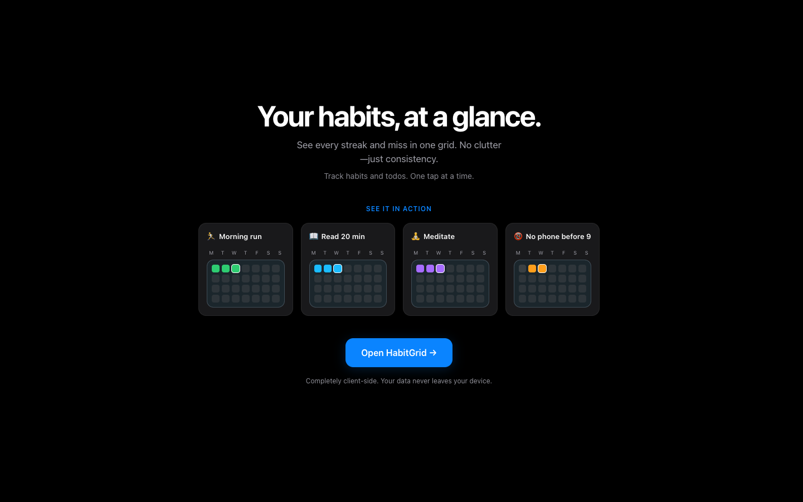
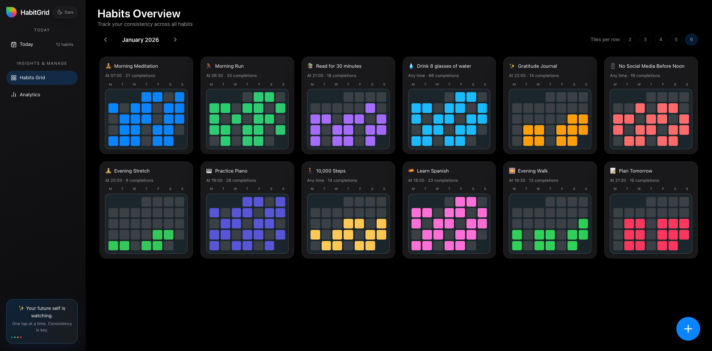
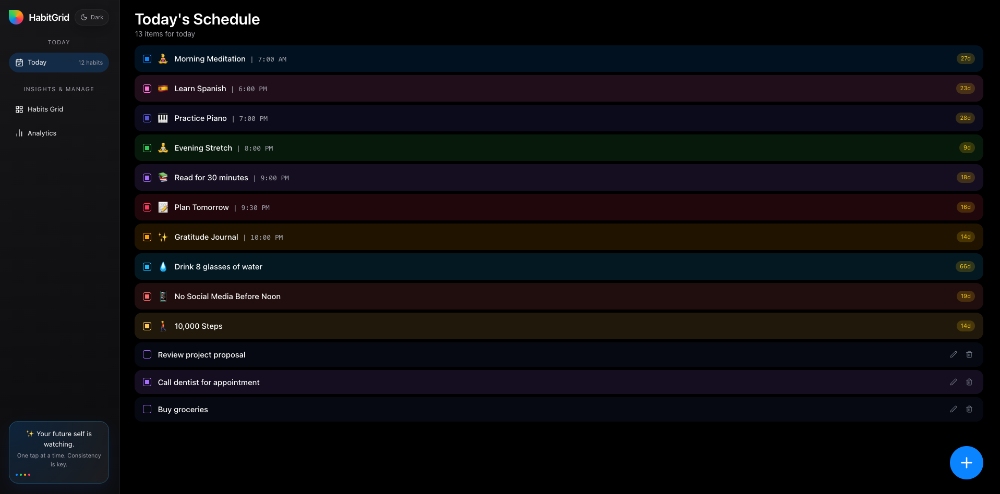
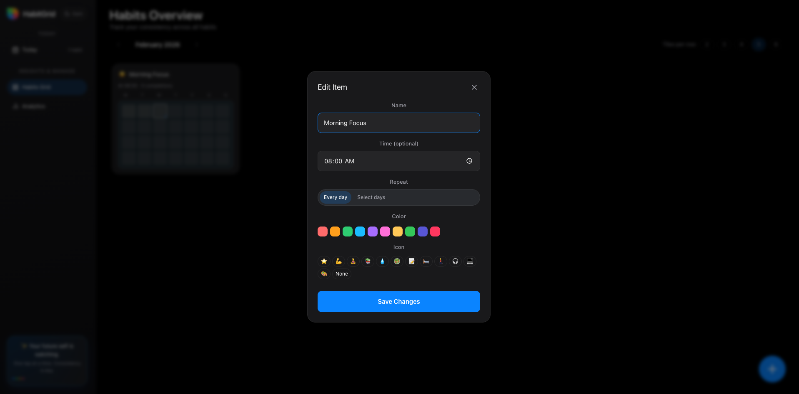

## HabitGrid

**HabitGrid** is a minimalist, high‑contrast habit tracker and daily schedule app, designed to make your consistency visible at a glance.

- **Habits Grid**: see an entire month of completions for every habit in a compact grid.
- **Today view**: a clean, scrollable schedule of everything you planned for today.
- **Analytics**: streaks, completion rates, and trends (per habit and overall).
- **Client‑side only**: all data is stored locally in your browser via `localStorage`. No accounts, no sync, no backend.

**Live app:** [Open HabitGrid](https://the-async-guy.github.io/habit-grid/)

### Screenshots

Home:

Habits grid:

Habit list:

Editing habits:

### Data & privacy

- All data (habits, completions, todos, preferences) lives in your browser’s `localStorage`.
- Clearing site data or using a different browser/machine will reset your HabitGrid state.
- There is currently no server‑side backup or sync.
